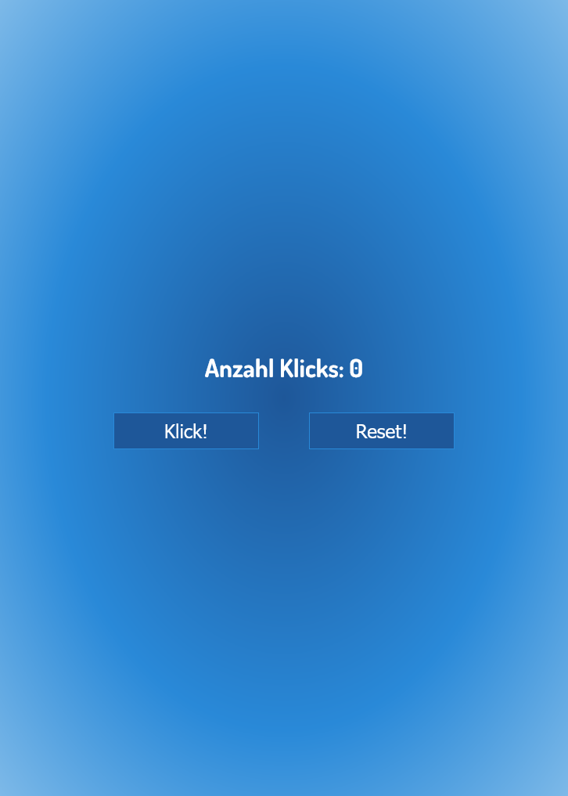

# Klick Zähler

# Project – Klick Zähler

Dies ist eine Lösung für eine Herausforderung bei einem Udemy Javascript kurs.In dieser Aufgabe ging es darum einen Klickzähler zu erstellen

## Inhaltsverzeichnis

- [Übersicht](#Übersicht)
  - [Screenshot](#screenshot)
  - [Links](#links)
- [Mein Prozess](#my-process)
  - [Erstellt mit](#built-with)
  - [Was ich gelernt habe](#what-i-learned)
  - [Fortsetzung der Entwicklung](#continued-development)
- [Autor](#Autor)

## Überblick

### Bildschirmfoto

### Links

- Lösungs-URL: [Github-Lösungen](https://github.com/Adem-Tozlu/Project-Udemy-Click-Counter)
- Live-Site-URL: [Website Klick Zähler](https://project-udemy-click-counter.vercel.app/)

## Mein Prozess

### Gebaut mit

- Semantisches HTML5-Markup
- Benutzerdefinierte CSS-Eigenschaften
- Javascript

### Was ich gelernt habe

Im Laufe dieses Projekts konnte ich meine Kompetenzen in folgenden Bereichen deutlich erweitern:

- Javascript: Die aktive Anwendung von Javascript im Projekt hat mir wertvolle Erfahrungen im Umgang mit dieser Programmiersprache vermittelt.

- DOM: Die Arbeit mit dem DOM (Document Object Model) hat mein Verständnis der Struktur und Funktionsweise von Webseiten auf HTML-Basis verbessert.

Zusammenfassend lässt sich sagen, dass dieses Projekt einen wichtigen Beitrag zu meiner fachlichen Weiterentwicklung geleistet hat.

### Weiterentwicklung

In Zukunft plane ich, meine Fähigkeiten im CSS-Bereich sowie auch Javascript zu verbessern. Mein Ziel ist es, komplexere Websites zu erstellen und diese besser zu gestalten.

## Autor

- Website - [Github](https://github.com/Adem-Tozlu)
- Frontend-Mentor – [@Adem-Tozlu](https://www.frontendmentor.io/profile/Adem-Tozlu)
- Linkedin - [@Adem-Tozlu](https://www.linkedin.com/in/adem-tozlu-8906b52a5)